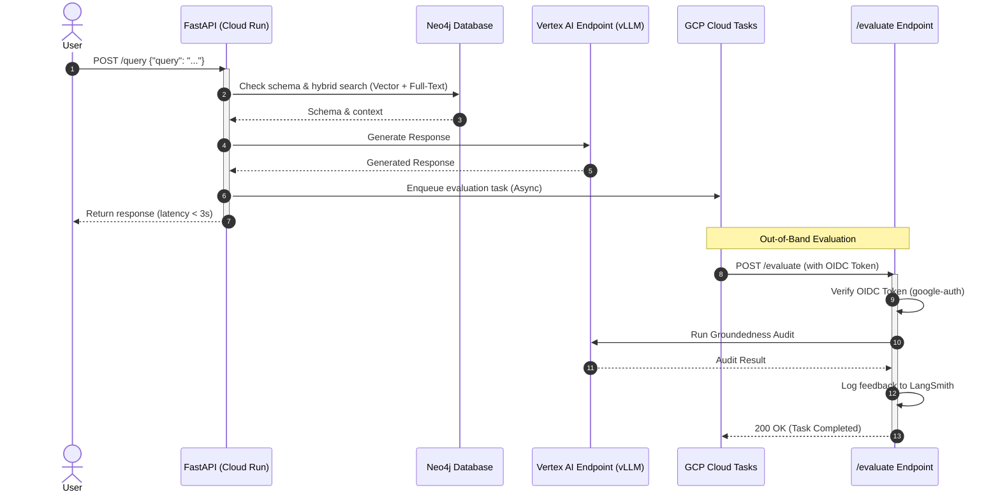

# Enterprise Ontology Discovery Agent

A production-grade, LangGraph-powered Graph-RAG agent designed to automate metadata discovery, lineage tracing, and conceptual search across enterprise data catalogs. By combining graph databases, self-hosted LLMs, and asynchronous MLOps pipelines, it delivers a secure, low-latency data discovery experience.

---

## System Architecture

The agent coordinates a multi-agent team using LangGraph state machines, retrieving context via a hybrid search pipeline, and executing out-of-band evaluation using GCP Cloud Tasks.



---

## Key Architectural Highlights

### 1. Agentic Graph-RAG (LangGraph + Neo4j)
- **Hybrid Retrieval:** Integrates Neo4j cosine vector similarity and BM25 full-text keyword indexing. Results are merged and ranked using **Reciprocal Rank Fusion (RRF)** to combine semantic and exact-match search.
- **Cypher Specialist with Self-Correction:** Generates Cypher queries dynamically using LLMs. If execution fails, the state machine routes the query and error traceback to a **Cypher Debugger** node for self-correction (up to 5 attempts).
- **Edge-Level Guardrails:** Implements a deterministic, regex-based Cypher safety auditor to block destructive write operations (e.g., `DELETE`, `DETACH`, `CREATE`) at the application edge before hitting the database.

### 2. Self-Hosted LLM Serving (Vertex AI + vLLM on NVIDIA L4)
- **Private Inference:** Deploys Qwen 2.5 7B using a custom **vLLM** container on a **GCP Vertex AI Endpoint** to keep proprietary enterprise metadata within the project's VPC.
- **Optimized VRAM Math:** Configured with `--tensor-parallel-size=1` and `--gpu-memory-utilization=0.85`. On a single **NVIDIA L4 GPU (24GB VRAM)**, this reserves 15% of VRAM (~3.6GB) for vLLM's PagedAttention KV cache, maximizing concurrent throughput while avoiding Out-of-Memory (OOM) crashes.
- **URL-Rewriting Hook:** Implements a custom `httpx` request event hook in the OpenAI client to transparently rewrite the default `/chat/completions` request path to Vertex AI's native `:rawPredict` suffix.

### 3. Decoupled Asynchronous Evaluation (GCP Cloud Tasks)
- **Sub-3-Second Latency:** Moves the LLM-as-a-Judge groundedness audit out of the synchronous user critical path. The user receives their response immediately, and the audit is enqueued.
- **Rate Limiting:** GCP Cloud Tasks queues rate-limit dispatches (max 2/sec, max 5 concurrent) to the `/evaluate` worker, preventing upstream LLM rate limit errors (HTTP 429s) under high traffic.

### 4. Zero-Trust Security (OIDC/IAM Authentication)
- **No Static Keys:** The `/evaluate` endpoint is secured using Google OIDC bearer token verification.
- **Verification Pipeline:** Utilizes `google-auth` to verify that the token is validly signed by Google, the audience matches our service URL, and the issuer matches the enqueuer service account (`ontology-agent-sa@<project-id>.iam.gserviceaccount.com`).

### 5. Infrastructure as Code & CI/CD
- **Declarative IaC:** Defines all GCP resources (Vertex AI Endpoints, Cloud Run Services, Cloud Tasks, Secrets) using **Terraform**.
- **Automated CI/CD:** Uses GitHub Actions to build, test, and deploy the application to GCP. Integrates keyless **Workload Identity Federation (WIF)** to authenticate with GCP without storing static service account keys in GitHub.

### 6. Observability (LangSmith)
- **Tracing & Cost Tracking:** All agentic runs are traced in **LangSmith** to monitor latency, token usage, and graph execution paths.
- **Feedback Loops:** The `/evaluate` worker logs the groundedness scores (1.0 for pass, 0.0 for fail) directly back to the matching LangSmith run ID, building a dataset for continuous model alignment.

---

## Quickstart

### Prerequisites
- Python 3.11+
- Neo4j Database (AuraDB or local)
- NVIDIA NIM API Key (or a deployed Vertex AI Endpoint)

### Setup & Run
1. **Clone the Repository:**
   ```bash
   git clone https://github.com/bandham-manikanta/ontology-discovery-agent.git
   cd ontology-discovery-agent
   ```

2. **Configure Environment Variables:**
   Create a `.env` file in the root directory:
   ```env
   NVIDIA_API_KEY=your_nvidia_api_key
   NEO4J_URI=bolt://localhost:7687
   NEO4J_USER=neo4j
   NEO4J_PASSWORD=your_neo4j_password
   ```

3. **Install Dependencies:**
   ```bash
   pip install -r requirements.txt
   ```

4. **Start the FastAPI Server:**
   ```bash
   uvicorn src.main:app --host 0.0.0.0 --port 8000
   ```

5. **Run the Test Suite:**
   ```bash
   pytest tests/
   ```