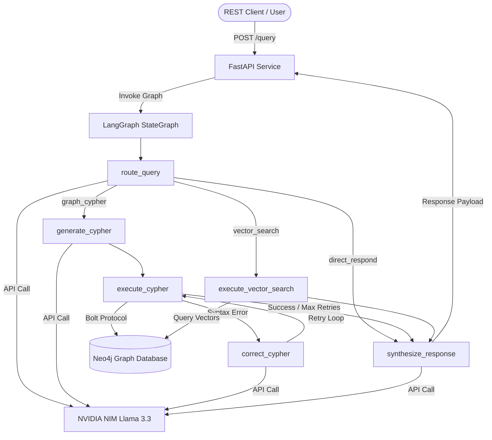

# Enterprise Ontology Discovery Agent — Implementation Report

This report provides a detailed, structured overview of all the architectural components, integrations, safety boundaries, and deployment resolutions implemented for the Enterprise Data Catalog Ontology Assistant.

---

## 1. System Architecture

The assistant orchestrates user queries using a state-machine workflow built on **LangGraph**, exposing the service via **FastAPI** and integrating with **NVIDIA NIM** (for LLM and embeddings) and **Neo4j** (as the backend graph database).



---

## 2. Component Implementation Details

### R1. State-Machine Orchestration
*   **Location:** [src/nodes.py](file:///C:/Users/bandh/Documents/projects_ws/ontology-discovery-agent/src/nodes.py) and [src/main.py](file:///C:/Users/bandh/Documents/projects_ws/ontology-discovery-agent/src/main.py)
*   **State Model:** Leverages `AgentState` TypedDict to coordinate the flow, retry counters, query generation errors, and raw database results.
*   **Self-Correction Compiler:** When a Cypher query execution triggers a syntax or schema error from Neo4j, the workflow routes to `correct_cypher_node` which feeds the failing query and database error trace to the LLM to get a corrected query. This loop repeats up to a maximum limit of **4 retries** before continuing.

### R2. FastAPI Service Endpoint & Middleware
*   **Location:** [src/main.py](file:///C:/Users/bandh/Documents/projects_ws/ontology-discovery-agent/src/main.py)
*   **Endpoints:** Exposes `POST /query` accepting `{"query": "..."}` payloads.
*   **Media Type Validation Middleware:** Custom HTTP middleware intercepts all requests to `/query`. It parses the incoming `Content-Type` header (splitting out parameters like `charset`) and strictly checks that the primary media type is `application/json`. If not, it blocks execution and returns a `415 Unsupported Media Type` response.
*   **Lifespan manager:** Conducts startup checks to verify that NVIDIA NIM (embeddings) and Neo4j are online and responding before finishing server initialization.

### R3. Strict Database Startup Checks (No Mocks)
*   **Location:** [src/database.py](file:///C:/Users/bandh/Documents/projects_ws/ontology-discovery-agent/src/database.py)
*   **Standard Driver Integration:** Replaced all mock driver fallbacks. The application requires a live connection to a Neo4j database (e.g. cloud Neo4j AuraDB).
*   **Connection Pool Reusability:** Employs a global thread-safe driver singleton (`_driver`) cached via `get_driver()` to prevent socket resource leaks and excessive TLS handshake overhead.
*   **Error Propagation:** Throws descriptive `ConnectionError` or `RuntimeError` exceptions when connectivity checks fail, preventing silent failures.

### R4. Model & Environment Configurations
*   **Location:** [.env](file:///C:/Users/bandh/Documents/projects_ws/ontology-discovery-agent/.env) and [src/database.py](file:///C:/Users/bandh/Documents/projects_ws/ontology-discovery-agent/src/database.py)
*   **NVIDIA NIM Wrapper:** Integrates with the official `openai` SDK pointing to `https://integrate.api.nvidia.com/v1`.
*   **Embedding Model:** `nvidia/nv-embedqa-e5-v5` (1024-dimensional float arrays).
*   **Chat Completions Model:** Updated to `meta/llama-3.3-70b-instruct` to solve response hangs and latency timeouts caused by the overloaded `meta/llama-3.1-70b-instruct` endpoint.
*   **Forced Environment Override:** Added `load_dotenv(override=True)` to ensure that configurations inside `.env` override cached variables in the active terminal shell context.

### R5. Cypher Write Protection
*   **Location:** [src/nodes.py](file:///C:/Users/bandh/Documents/projects_ws/ontology-discovery-agent/src/nodes.py#L92-L97)
*   **Security Checker:** Before executing any generated Cypher query against the database session, the string is cleaned and parsed using boundary regex checks. Any case-insensitive match of modifying statements (`CREATE`, `MERGE`, `SET`, `DELETE`, `REMOVE`, `DETACH`) is blocked, returning a security error payload to the client without querying the database.

---

## 3. Database Seeding Implementation

*   **Location:** [src/seed_data.py](file:///C:/Users/bandh/Documents/projects_ws/ontology-discovery-agent/src/seed_data.py)
*   **Pre-generated Embeddings:** Before opening a database session, the script pre-fetches all 1024-dimensional embeddings via NVIDIA NIM. This prevents database transactions from timing out during network-idle periods.
*   **Schema & Constraints:** Initializes unique constraints (`CREATE CONSTRAINT FOR (d:Dataset) REQUIRE d.name IS UNIQUE`) and waits for index propagation.
*   **Data Seeding:** Populates the graph with:
    *   **Domains:** `Connected_Vehicle`, `Supply_Chain_Operations`, `Financial_Analytics`.
    *   **Datasets:** `Vehicle_Telemetry_Gold`, `Supplier_Invoices_Raw`, `Dealer_Financing_Silver`, `Legacy_FOTA_Logs`.
    *   **Columns:** 7 columns (including data types, description, and PII flags).
    *   **Owners:** 3 owners (including department and email).
    *   **Relationships:** Establishes `CONTAINS`, `HAS_COLUMN`, `OWNED_BY`, and `DEPENDS_ON` (lineage) links.

---

## 4. Environment & Deployment Solutions

| Issue | Root Cause | Implemented Resolution |
| :--- | :--- | :--- |
| **WSL directory locks** | Non-root container users can't write to Windows host folders mounted via WSL. | Configured native **Docker Named Volumes** (`neo4j_data`) to let Docker manage file ownership cleanly. |
| **WSL VM sleeping** | Docker Desktop's Resource Saver stops containers after 30 seconds of low CPU. | Added a container-native **healthcheck** to `docker-compose.yml` to query the HTTP port every 10s, keeping the VM awake. |
| **Local Port forward breaks** | Windows sleep breaks WSL `localhost` bridge forwarding. | Migrated host configuration to **Neo4j AuraDB Free** cloud service, completely bypassing local virtualization layers. |
| **Synthesis Hangs** | Overloaded `llama-3.1-70b-instruct` endpoint timing out. | Upgraded configuration to **`meta/llama-3.3-70b-instruct`** for instant (under 2s) response generation. |

---

## 5. Verification Results

### 1. Database Seeding
Running `uv run python src/seed_data.py` successfully completed:
```text
Generating embeddings via NVIDIA NIM...
Generating embedding for dataset: Vehicle_Telemetry_Gold...
...
Setting up unique constraints and indexes...
Constraints and indexes configured successfully!
Seeding enterprise ontology graph...
Setting up node relationships...
Graph database seeding complete!
```

### 2. Write Security Boundary Test
*   **Payload:** `{"query": "Please CREATE a new Owner node named Eve in the database"}`
*   **Output:**
    ```json
    {
        "response": "Database query execution failed. Error: Modifying Cypher operations are blocked.",
        "meta": {
            "routing_decision": "graph_cypher",
            "compiled_cypher": "`MATCH (n) WHERE NOT (n:Owner) CREATE (e:Owner {name: \"Eve\", email: \"\", department: \"\"})`",
            "retry_count": 1,
            "has_errors": true
        }
    }
    ```
