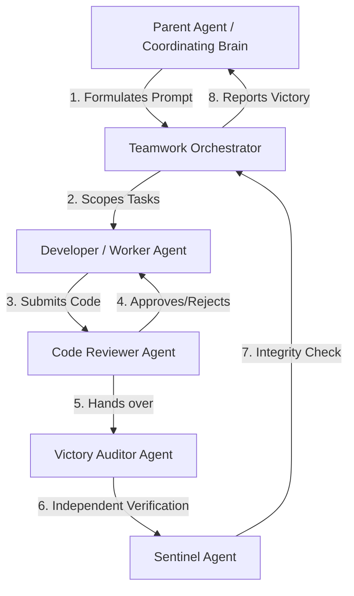

# Multi-Agent Teamwork Orchestration (`/teamwork-preview`)
This report provides a detailed technical overview of the `/teamwork-preview` multi-agent system, its underlying architecture, core design principles, and how it operates to deliver verified, production-ready software.

---

## 1. Overview & Architecture
The `/teamwork-preview` tool is an advanced multi-agent orchestration framework designed to handle complex software engineering workloads. Instead of relying on a single agent to write, test, and verify code, the system spawns a **collaborative team of specialized agents** working in parallel under a structured hierarchy.



### Specialized Agent Roles:
1.  **Teamwork Orchestrator:** Acts as the project manager. It analyzes the requirements, plans the implementation phases, assigns sub-tasks to the developer, and coordinates handoffs between the other agents.
2.  **Developer / Worker Agent:** Focused entirely on writing clean, functional code, setting up environment dependencies, and writing comprehensive test suites.
3.  **Code Reviewer Agent:** An independent quality assurance agent. It reviews all code changes, checks for linting errors, ensures adherence to best practices, and rejects pull requests that do not meet the quality bar.
4.  **Victory Auditor Agent:** Conducts a rigorous, independent 3-phase audit of the final deliverables. The Auditor does not write code; its sole purpose is to break the implementation by running adversarial tests and validating the acceptance criteria.
5.  **Sentinel Agent:** Ensures the overall integrity of the codebase. It monitors files to prevent regressions, verifies that no security vulnerabilities or hardcoded bypasses are introduced, and confirms that the final handoff is clean.

---

## 2. Technical Details of the Orchestration Loop

### A. The State Machine & Handoff Protocol
The Orchestrator maintains a structured state machine. Communication between agents is strictly controlled to prevent context contamination:

1.  **Task Scoping:** The Orchestrator decomposes the main prompt into a set of sequential milestones. It generates a localized context file (e.g., `milestone_1.md`) for the Developer.
2.  **Development & Self-Testing:** The Developer implements the logic in the designated workspace. Before submitting, the Developer must write and execute local tests (e.g., `pytest` or `npm test`).
3.  **Review Phase:** When the Developer marks a milestone as complete, the Reviewer agent is activated. The Reviewer runs a static analysis and attempts to compile/run the code.
    *   *If the Reviewer finds issues:* It writes a structured feedback report (detailing compile errors, lint failures, or missing edge cases) and sends it back to the Developer. The state reverts to **Development**.
    *   *If the Reviewer approves:* It signs off and promotes the code to the **Audit Phase**.

### B. The 3-Phase Audit Process
The **Victory Auditor** operates in an isolated environment (or a separate branch) to ensure that the Developer's local environment has not contaminated the verification:

```
[Audit Phase 1: Environment & Setup] ──> [Audit Phase 2: Adversarial Testing] ──> [Audit Phase 3: Rubric Assessment]
```

1.  **Phase 1: Environment & Setup Verification**
    *   Cleans the workspace of all untracked files (`git clean -fdx`).
    *   Installs dependencies from scratch (`pip install -r requirements.txt` or `npm install`) to verify that the environment is fully reproducible and no hidden local dependencies are missing.
2.  **Phase 2: Adversarial Testing**
    *   Executes the test suites with boundary and malicious inputs.
    *   For example, in a database agent, the Auditor will inject SQL/Cypher write commands (e.g., `DROP DATABASE`, `DELETE`) to verify that safety guardrails and write-blockers cannot be bypassed.
3.  **Phase 3: Rubric Assessment**
    *   Evaluates the output against the binary checkmarks defined in the Acceptance Criteria.
    *   If all checks pass, the Auditor issues a `VICTORY CONFIRMED` verdict. If any check fails, a regression report is sent back to the Orchestrator, and the loop restarts.

---

## 3. Core Design Principles
The teamwork system operates under four foundational principles to ensure high-quality software output:

| Principle | Description | Rationale |
| :--- | :--- | :--- |
| **Specify What, Not How** | Prompts define the *requirements* and *acceptance criteria*, never the specific implementation files, algorithms, or libraries. | Preserves the agent team's solution space and allows them to design the optimal architecture. |
| **Objective Verification** | Every requirement must have an automated verification mechanism (e.g., test suites, metric scripts) independent of the developer's self-assessment. | Prevents agents from "self-certifying" half-baked or non-functional work. |
| **Acceptance Criteria as Guardrails** | Clear, binary checkmarks (pass/fail) are set before the run. If a run falls short, criteria are tightened and the team re-runs. | Establishes an objective, non-negotiable quality bar. |
| **Minimal Requirements** | Only specify the constraints the user explicitly cares about. Let the teamwork system infer the rest. | Prevents over-constraining the agents, which leads to brittle code. |

---

## 4. Prompt Engineering: Poor vs. Well-Formed Prompts

To get the best results from the teamwork system, the prompt must focus on **outcomes** and **verification**, rather than step-by-step instructions.

### ❌ Example: A Poorly-Formed (Over-Constrained) Prompt
> "Create a Python script named `search.py`. Use a TF-IDF vectorizer from `scikit-learn` to index the documents. Write a function called `get_results(query)` that returns a list. Make sure you use a cosine similarity formula that you write yourself. Put the database in a file called `db.json`."

*   **Why it fails:** 
    *   It constrains the file names (`search.py`, `db.json`) and function signatures.
    *   It dictates the technology (`scikit-learn`, TF-IDF) and algorithm (cosine similarity), preventing the agent from using a more modern, high-performance approach (like BM25 or vector embeddings).
    *   It has **zero verification mechanisms** or acceptance criteria, meaning the agent will self-certify as soon as the file compiles.

###  Example: A Well-Formed (Outcome-Oriented) Prompt
> **Goal:** Implement a high-performance text search engine over a provided dataset of 1,000 product descriptions.
>
> **Requirements:**
> *   **R1. Search Interface:** Provide an HTTP GET endpoint `/search?q=<query>` that returns matching documents sorted by relevance.
> *   **R2. Performance:** The endpoint must respond in under 100ms for any query.
>
> **Acceptance Criteria:**
> *   The service must pass a load test of 10 concurrent requests per second with a latency p95 < 120ms.
> *   Given a test query "red waterproof jacket", the top 3 results must contain the words "waterproof" and "jacket".
> *   A test script `tests/verify_search.py` must run automatically and exit with code 0.

*   **Why it succeeds:**
    *   It specifies the **behavior** (HTTP endpoint, latency) and the **data**.
    *   It leaves the implementation details (libraries, indexing strategy, data structures) to the agent team.
    *   It provides **automated, objective verification** (latency check, keyword relevance check).

---

## 5. Integrity Modes
Depending on the project's goals, the system operates in one of three integrity modes:

*   **`development` (Default):** Standard development mode. The agent team has full flexibility to use pre-built libraries, copy open-source templates, and run external scripts to achieve the goal quickly.
*   **`demo`:** Showcase mode. Restricts copying core logic from existing projects. The agents must write the core business logic from scratch to prove capability, but can use standard frameworks.
*   **`benchmark`:** High-integrity mode. Extremely strict constraints on external dependencies, reading test source code beforehand, or using pre-built shortcuts. Used for rigorous evaluations.

---

## 6. Case Study: `ontology-discovery-agent`
This workspace is a prime example of `/teamwork-preview` in action. The tool was used to implement the **Enterprise Ontology Discovery Agent**:

*   **Prompt Formulation:** A prompt was drafted defining the LangGraph agentic workflow, Neo4j hybrid search (Vector + Full-Text with RRF), Cypher self-correction loop, and GCP Cloud Tasks rate-limited async evaluation.
*   **Integrity Mode:** Set to `demo` to ensure all custom Graph-RAG and Cypher write-blocking nodes were written natively without relying on mock templates.
*   **Production Implementation & Deployment:**
    *   **Vertex AI Hosting:** Custom vLLM serving container for Qwen 2.5 7B is 100% deployed and active on a Vertex AI Endpoint using an NVIDIA L4 GPU.
    *   **URL-Rewriting Hook:** Fully implemented an `httpx` request event hook in [database.py](file:///C:/Users/bandh/Documents/projects_ws/ontology-discovery-agent/src/database.py) to transparently rewrite OpenAI API `/chat/completions` paths to Vertex AI `:rawPredict` endpoints.
    *   **OIDC/IAM Security:** Fully implemented OIDC bearer token verification using `google-auth` on the `/evaluate` endpoint to authenticate requests originating from GCP Cloud Tasks.
    *   **Integration Testing:** 100% passing tests (124/124) verifying the entire pipeline end-to-end, including routing, hybrid search, self-correction, and secure evaluation.
*   **Audit Results:**
    *   **124/124 Tests Passed:** The developer agent wrote a comprehensive test suite in `tests/test_challenger.py` covering adversarial write-blocking, routing, and RRF ranking.
    *   **Victory Confirmed:** The independent Victory Auditor ran the test suite, verified the Cloud Tasks integration, checked the LangSmith tracing config, and officially issued the `VICTORY CONFIRMED` verdict.
    *   **Handoffs Generated:** Detailed handoff logs were written to `.agents/sentinel/handoff.md` and `.agents/victory_auditor_demo/handoff.md`.
